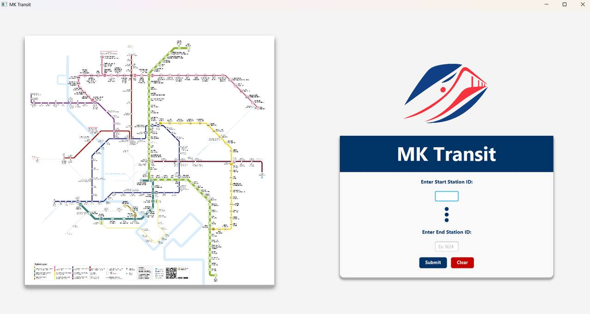
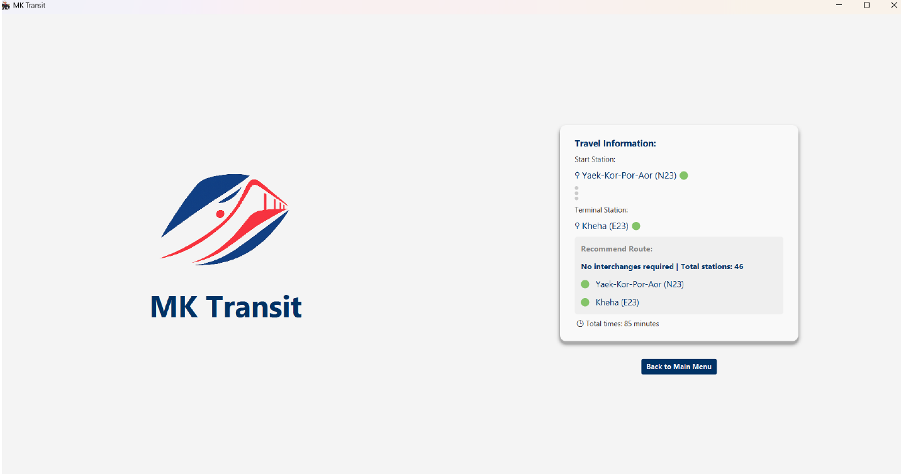

# MK-Transit (Mongkol-Transit)

## About this project:

This project is a metro route display system developed to assist users in finding the most suitable routes for traveling via various electric train lines within Bangkok and its metropolitan area.

## Overview:

This program can calculate the travel time from the departure station to the destination station by considering the shortest travel duration. It clearly indicates transfer points between lines. Users can input their starting and ending stations, and the system will display the optimal route, including the number of stations, transfer points, and travel time. Additionally, the program features a GUI built with JavaFX to enhance user convenience.

## Tech used:
- Java
- JavaFX
- Gradle

## Data Structures used:
- ### Graph
A graph is used where each vertex represents a station on the metro lines, and each edge represents a connection between stations — for example, from "Mo Chit" to "Bang Wa". The reason for using this data structure is that the metro system resembles "a map of points (stations) connected by routes", which is essentially what a graph represents.

- ### HashMap
Used to store station data, where the key is the station code and the value is a Station object containing the station name and the train line. This allows for fast access to station information in O(1) time complexity.

- ### PriorityQueue 
Used in Dijkstra’s Algorithm to select the path with the lowest weight at each step — in other words, to choose the route with the shortest travel time.

- ### List (ArrayList)
Used to store all possible routes from the starting station to the destination station, to record transfer points along the route, to store stations on each line, and to keep track of connection points at each station.

- ### Dijkstra's Algorithm
To find the shortest path from the starting station to the destination station by considering the travel time between stations.

## How to use the program:

```
- Open the GUI.
- Enter your current station and your destination.
- Submit.
- The program will display the shortest routes with interchage station (if exists).
```



MK Transit is a group project for CPE112 [ Programming with Data Structures ] Class at [CPE KMUTT](https://www.cpe.kmutt.ac.th/en/) | BKK, TH.
---
| Student number | Fullname               | 
|----------------|------------------------|
| 67070501014    | NAPATR KASEMWEERASAN   |
| 67070501015    | NAPHAT UTABUAWONG      |
| 67070501023    | THANATIP NITINANTAKUL  |
| 67070501028    | NANTAKORN PINSUPAPORN  |
| 67070501031    | BENJAMIN GARFORTH      |

## How to checkout the project:

Feel free to clone our project 
```
- git clone https://github.com/ThnaChamp/MK-Transit.git
```
How to run ?
```
- gradle run
```